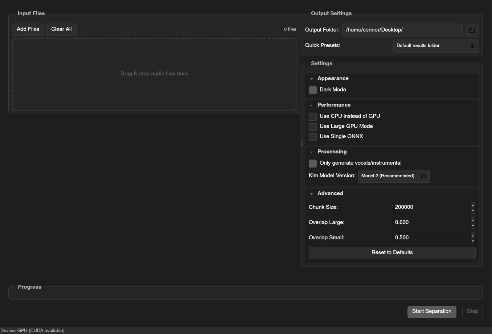

# Modern GUI for ZFTurbo/MVSEP-MDX23

## Usage
```
python gui_modern.py
```

## Screenshot


With this command audios with names "mixture1.wav" and "mixture2.wav" will be processed and results will be stored in `./results/` folder in WAV format.

### Notes
* If you have not enough GPU memory you can use CPU, but it will be slow. Additionally you can use single ONNX, but it will decrease quality a little bit. Also reduce of chunk size can help.
* In current revision code requires less GPU memory, but it process multiple files slower. If you want old fast method use argument. It will require > 11 GB of GPU memory, but will work faster.

## Quality comparison

Quality comparison with best separation models performed on [MultiSong Dataset](https://mvsep.com/quality_checker/leaderboard2.php?sort=bass). 

| Algorithm     | SDR bass  | SDR drums  | SDR other  | SDR vocals  | SDR instrumental  |
| ------------- |:---------:|:----------:|:----------:|:----------:|:------------------:|
| MVSEP MDX23   | 12.5034   | 11.6870    | 6.5378     |  9.5138    | 15.8213            |
| Demucs HT 4   | 12.1006   | 11.3037    | 5.7728     |  8.3555    | 13.9902            |
| Demucs 3      | 10.6947   | 10.2744    | 5.3580     |  8.1335    | 14.4409            |
| MDX B         | ---       | ----       | ---        |  8.5118    | 14.8192            |
